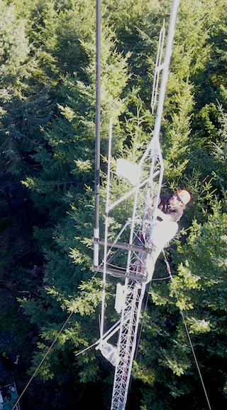

<html>
<body>

<h3>Amateur Radio</h3>
<h4>Software development for computer aided transceivers and other amateur radio related items.
</h4>

This repository is dedicated to software development for computer aided transceivers (CAT) and to software develpment for amateur radio applications in general.  Linux and open source applications are highly encouraged.

<h4>Contents</h4>

<b>Yaesu FT991A Transceiver</b> 
<ul>
<li>FT991 Utility
<ul>
<li>CAT command passthrough for software development</li>
<li>Programming FT991 channel memory</li>
<li>Backup FT991 configuration (menu items)</li>
</ul>
</li>
</ul>

<b>AREDN Mesh</b> 
<ul>
<li>arednsig - a web app for viewing long term SNR statistics</li>
<li>nodePower - a Raspberry Pi Zero app for monitoring battery
current, voltage, and temperature at an AREDN node installation.</li>
</ul>

</body>
</html>
